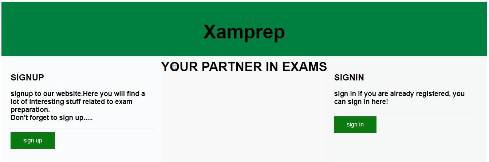

# Xamprep

#### YOUR PARTNER IN EXAMS

A sample university website for sharing mock question papers to the students. This is the authentication part of the website.

students are required to sign in before actually accessing the mock papers, in case if some one does not have a user account they can sign up for free.

**Home screen** 

## Xampp configuration

1. The website used xampp for connection and without a online sql server it cannot work. The database which is been used by the site is MYSQL through PHPMYadmin.
2. To run the website, first install xampp [here](https://www.apachefriends.org/download.html) and add the folder web in the folder named htdocs inside xampp folder in your drive.
3. Dont forget to start Apache and mysql in xampp control panel. [Note: If you have installed MYSQL before, you will nwwd to change the port number for this sql server otherwise mysql won't start.]
4. You can type http://localhost/phpmyadmin/ to use database server.

## Direct Access
Access website directly without login or signup to get an idea about it - [Xamprep](https://arushi0302.github.io/XAMPREP/web/webmain.html)

Hope you liked my website's authentication sample page, apart from it the actual sign in / sign up page, the website can also calculate the gpa of student, provide motivational blog and some required books pdf. The website is a simple working model but lacks styling and other aspects which can be added by further detailing.

Also the website uses mysql database through xampp for storing data of registered students.
